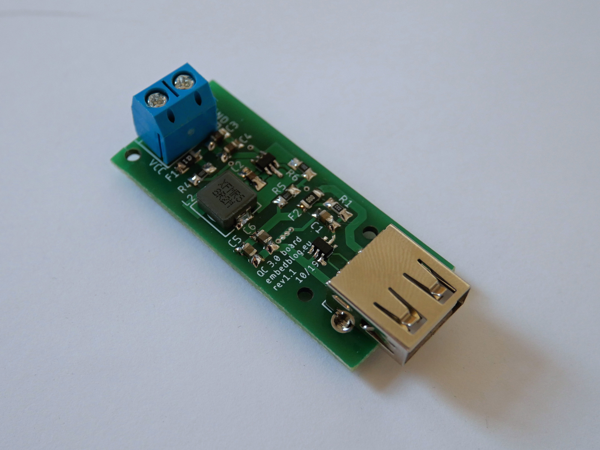

# QC3.0 board
*see the article [here](http://embedblog.eu/?p=504). Also available on [Tindie](https://www.tindie.com/products/martind/quick-charge-qc-30-buck-converter-board/)*

Board with a switching buck converter and a QC 3.0 class-A chip (it also supports FastCharge, DCP, and others).

## Features:
* HiSilicon Fast Charging Protocol (FCP), ie Huawei phones (tested)
* Qualcomm Quick Charge 2.0/3.0 Class A: up to 12 V Output Voltage (tested)
* USB DCP (shorting D+ Line to D-) per USB Battery Charging Specification, Revision 1.2 (tested)
* USB DCP (applying 2.7V on D+ Line and 2.7V on D- Line), ie Apple 12 W
* USB DCP (applying 1.2V on D+ and D- Lines) - Chinese Telecommunication Industrial Standard YD/T 1591-2009 (whatever that is, I have not tested that)

## Specs:
* input voltage: 6 - 15 V, recommended 12 - 15 V
* input current: max 2 A
* output current: max 2 A
* efficiency (Vin = 12 V, Vout = 5 V, Iout = 1 A): 95 %
* efficiency (Vin = 12 V, Vout = 5 V, Iout = 2 A): 92 %
* quiescent current (no load connected, Vin = 12 V): 800 µA